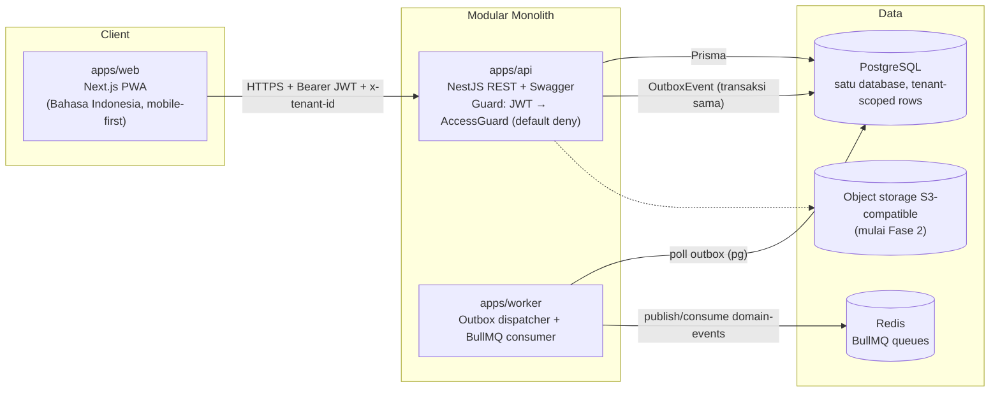

# Container Diagram

## Alasan bentuk

- **Modular monolith** (ADR-001): satu deployable `api`, batas modul ditegakkan lewat struktur module NestJS + kepemilikan tabel + domain event.
- **Transactional outbox** (ADR-001/004): mutasi + event ditulis dalam satu transaksi; worker mempublikasikan asinkron → modul dapat dipecah menjadi service tanpa mengubah semantik event.
- **Worker terpisah proses** agar beban background (sync, retry, notifikasi) tidak mengganggu latensi API.
