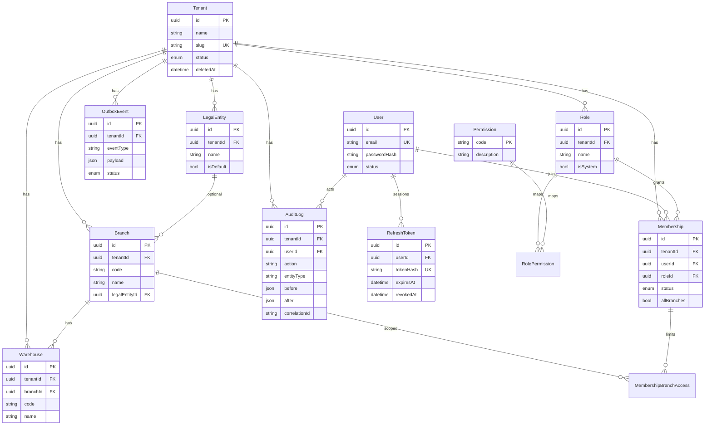
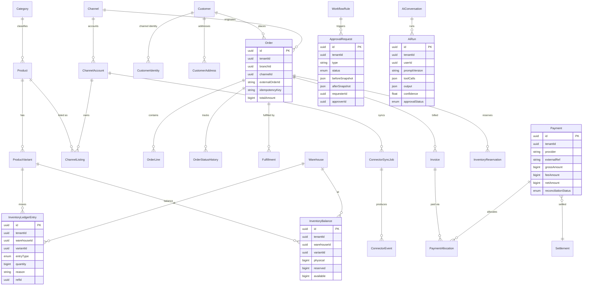

# Data Model

Skema Fase 1 sudah terimplementasi di `apps/api/prisma/schema.prisma`. ERD di bawah mencakup **model Fase 1 (implemented)** dan **model target MVP** (Fase 2–6, dicantumkan agar desain konsisten).

## Prinsip

- Setiap tabel bisnis punya `tenantId` + index (kecuali entitas global: `User`, `Permission`).
- Soft delete (`deletedAt`) untuk data bisnis; tidak ada hard delete.
- Uang: integer rupiah (`BigInt`) atau `Decimal` — bukan float.
- Timestamp UTC (`createdAt`, `updatedAt`).
- Stok dikelola lewat **inventory ledger append-only**, bukan update saldo langsung (ADR-003).
- Idempotency: `Order` punya unique `(tenantId, channelId, externalOrderId)` dan `(tenantId, idempotencyKey)`.

## ERD — Fase 1 (implemented)

Constraint penting Fase 1: `Tenant.slug` unique; `Branch/Warehouse (tenantId, code)` unique; `Membership (tenantId, userId)` unique; `Role (tenantId, name)` unique; index `AuditLog (tenantId, createdAt)` dan `(tenantId, entityType, entityId)`; index `OutboxEvent (status, createdAt)`.

## ERD — Target MVP (Fase 2–6)

Jenis `InventoryLedgerEntry.entryType`: `RECEIPT`, `RESERVATION`, `RESERVATION_RELEASE`, `SALE`, `FULFILLMENT_ISSUE`, `RETURN`, `TRANSFER_OUT`, `TRANSFER_IN`, `ADJUSTMENT`, `DAMAGE`, `EXPIRY`.

Saldo stok yang diturunkan: physical, reserved, available (= physical − reserved), incoming, in-transit, damaged, returned, safety stock.
