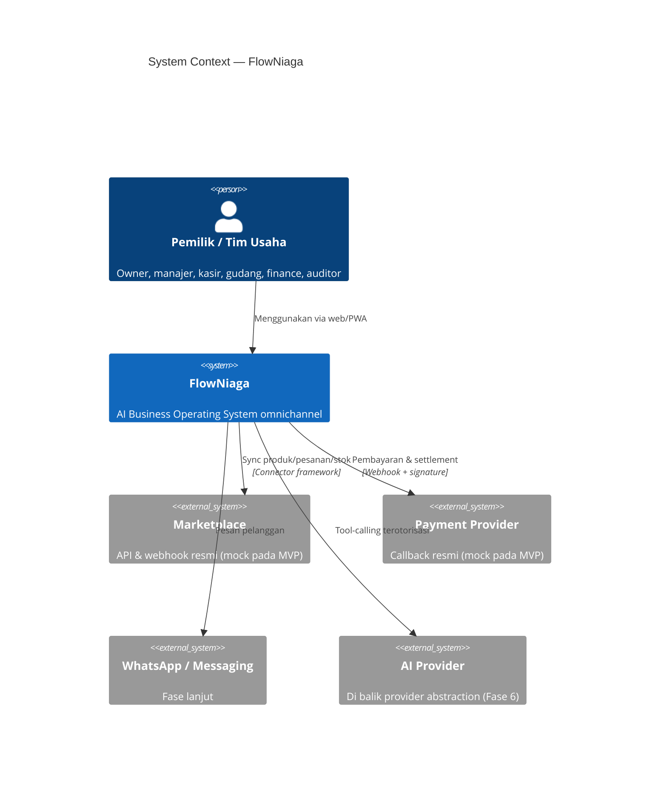

# System Context

```mermaid
C4Context
  title System Context — FlowNiaga
  Person(owner, "Pemilik / Tim Usaha", "Owner, manajer, kasir, gudang, finance, auditor")
  System(flowniaga, "FlowNiaga", "AI Business Operating System omnichannel")
  System_Ext(marketplace, "Marketplace", "API & webhook resmi (mock pada MVP)")
  System_Ext(payment, "Payment Provider", "Callback resmi (mock pada MVP)")
  System_Ext(wa, "WhatsApp / Messaging", "Fase lanjut")
  System_Ext(ai, "AI Provider", "Di balik provider abstraction (Fase 6)")

  Rel(owner, flowniaga, "Menggunakan via web/PWA")
  Rel(flowniaga, marketplace, "Sync produk/pesanan/stok", "Connector framework")
  Rel(flowniaga, payment, "Pembayaran & settlement", "Webhook + signature")
  Rel(flowniaga, wa, "Pesan pelanggan")
  Rel(flowniaga, ai, "Tool-calling terotorisasi")
```

Seluruh integrasi eksternal melewati **Channel & Integration Hub** dengan kontrak connector seragam (`docs/integrations/connector-contract.md`). Tidak ada scraping.
